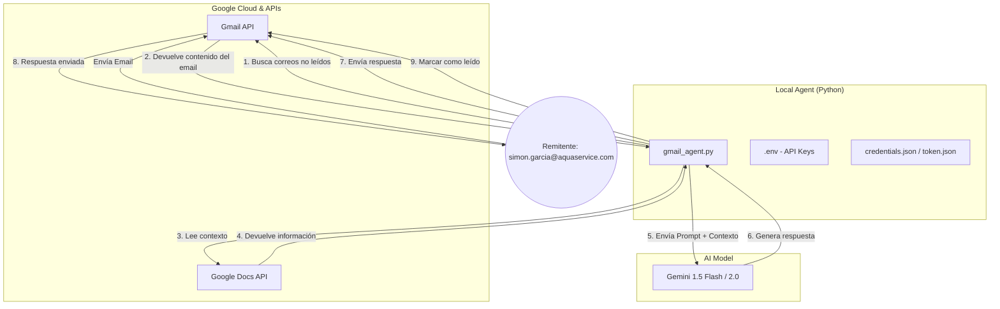

# Google ADK - Gmail Agent

Este proyecto contiene un agente inteligente que automatiza las respuestas de Gmail basándose en el contexto de un documento de Google Docs utilizando la IA de Gemini.

## Arquitectura del Sistema

## Configuración
1. Crea un entorno virtual: `python -m venv .venv`
2. Instala dependencias: `pip install -r requirements.txt`
3. Configura el archivo `.env` con tus claves.
4. Añade tu `credentials.json` en la raíz.
5. Ejecuta: `python gmail_agent.py`
